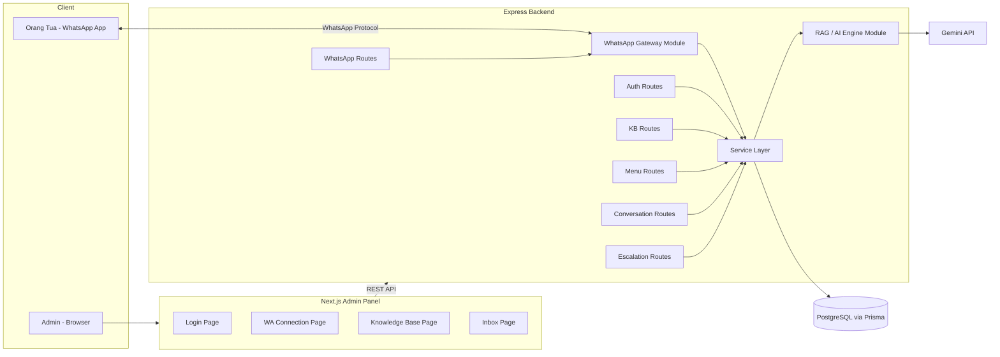
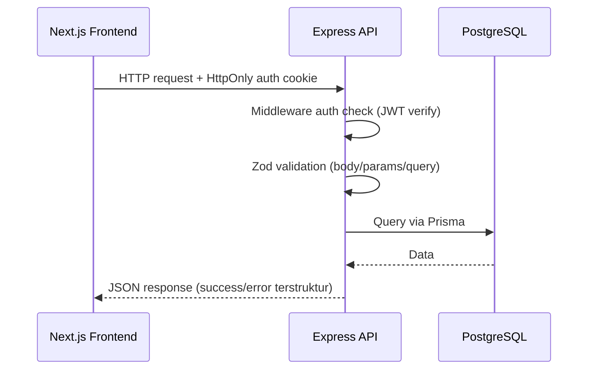
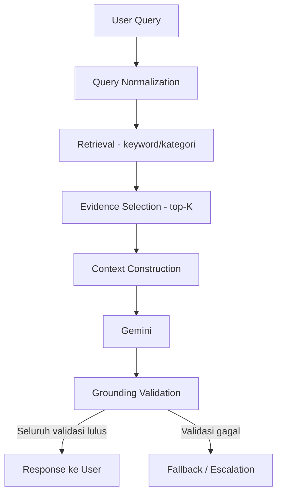
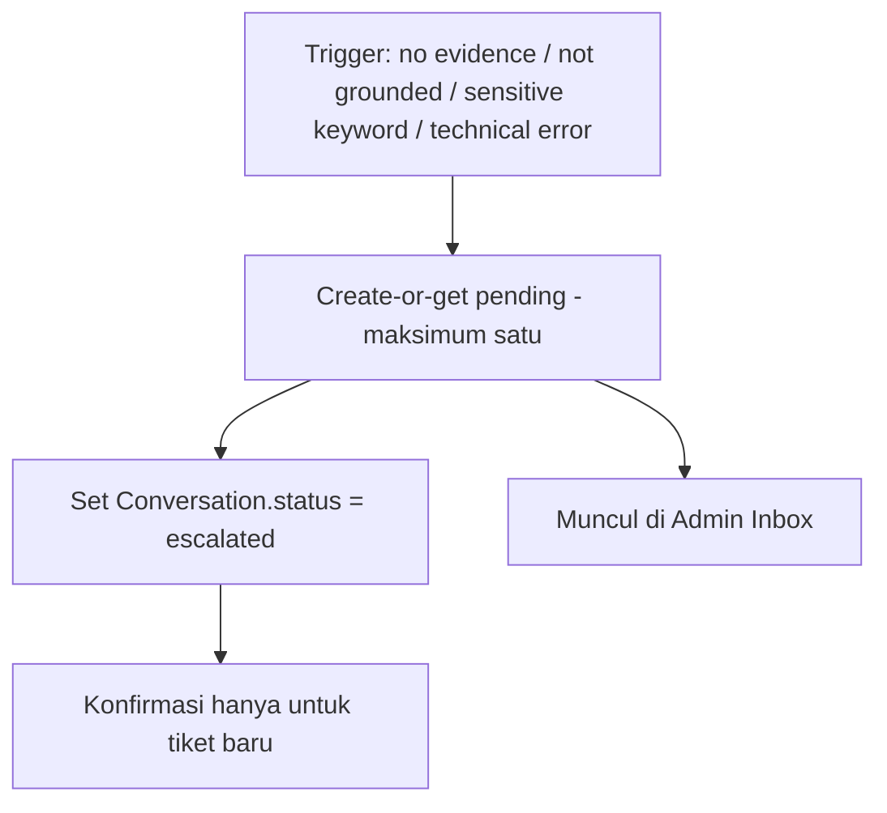
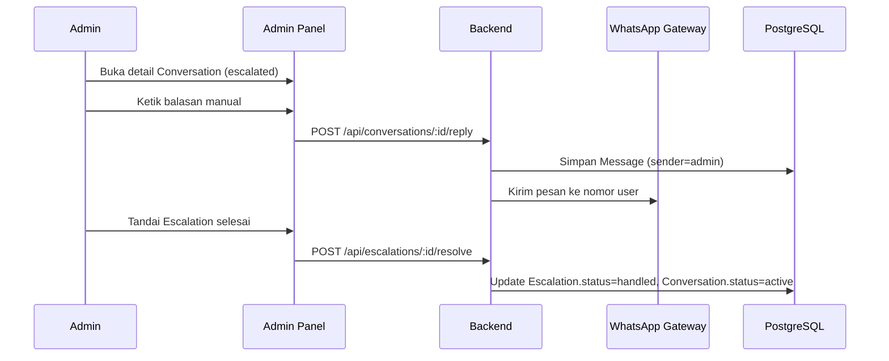

# TRD — TIVAsk (TI Virtual Assistant School Knowledge)

**Versi Dokumen:** 2.1 — Revised TRD (patch terarah atas v2.0)
**Source of truth produk:** `PRD-TIVAsk-Revised.md`
**Status:** Siap digunakan sebagai acuan development oleh coding agent

---

## 1. Technical Overview

TIVAsk terdiri dari empat modul utama yang saling terhubung lewat REST API dan database bersama:

```
Frontend (Next.js Admin Panel)
        ↓  REST API (HTTPS, JSON)
Backend Services (Express + TypeScript)
        ↓                    ↓                    ↓
PostgreSQL (Prisma)   AI Engine (Gemini)   WhatsApp Gateway (whatsapp-web.js)
```

Backend berjalan sebagai satu proses Node.js yang menghosting REST API sekaligus client `whatsapp-web.js` (bukan proses terpisah), sesuai keputusan tim di draft prototype. Perubahan Knowledge Base/menu dari Admin Panel langsung terbaca oleh bot lewat query database — tidak ada redeploy yang diperlukan untuk update konten.

---

## 2. Tech Stack

Stack mengikuti baseline prototype, dengan satu penggantian SDK Gemini ke `@google/genai` karena proyek belum mulai dibangun. Arsitektur dan scope hackathon dipertahankan.

**Frontend**
- Next.js 16.3.x (App Router) + React 19.2.x
- TypeScript
- Tailwind CSS 4.x + shadcn/ui 4.21.x
- `@tanstack/react-query` 5.102.x
- `react-hook-form` + `@hookform/resolvers` + Zod
- `qrcode.react` 4.2.x
- `lucide-react`, `sonner`, `next-themes`, `cva`, `tw-animate-css`
- `@base-ui/react`

**Backend**
- Node.js + TypeScript
- Express.js 5.2.x
- `whatsapp-web.js` 1.34.x + `qrcode` 1.5.x
- `@google/genai` — Google GenAI SDK; pilih versi stabil kompatibel saat M0 dan pin di lockfile
- Prisma ORM 6.4.x + PostgreSQL
- Zod 4.5.x
- `@scalar/express-api-reference` 0.10.x
- `cors`, `dotenv`
- **Baru ditambahkan:** `bcrypt` (atau `argon2`) untuk hashing password — belum ada di stack prototype, diperlukan untuk memenuhi NFR keamanan (PRD §7). Alasan teknis: bcrypt dipilih karena maturity dan kemudahan integrasi Node.js native tanpa kompilasi tambahan yang rumit.
- **Baru ditambahkan:** `jsonwebtoken` — untuk menghasilkan/memverifikasi token sesi admin (JWT), mendukung keputusan Assumptions #6 di PRD.

**Testing**
- Vitest, Supertest, Playwright, ESLint, Prettier

Penggantian SDK mengikuti [panduan migrasi resmi Google](https://ai.google.dev/gemini-api/docs/migrate). `lib/geminiClient.ts` menggunakan `GoogleGenAI` dan `ai.models.generateContent({ model, contents, config })`, dengan konfigurasi JSON structured output, lalu validasi Zod di backend (§10.5–10.6). Model dipilih melalui `GEMINI_MODEL`; menu tidak mengakses client ini.

Menu menggunakan pengiriman teks biasa. [README resmi whatsapp-web.js](https://github.com/wwebjs/whatsapp-web.js) menandai pengiriman native lists/buttons deprecated; native List Message bukan dependency Must Have.

---

## 3. System Architecture

### 3.1 Component Diagram



### 3.2 Request Flow (Admin Panel → Backend)



### 3.3 Chat Processing Flow

```mermaid
sequenceDiagram
    participant U as User WhatsApp
    participant WA as WhatsApp Gateway
    participant F as Message Filter
    participant SVC as Chat Service
    participant RAG as RAG Engine
    participant DB as PostgreSQL

    U->>WA: Kirim pesan
    WA->>F: Event message
    F->>F: Filter awal, claim externalMessageId unik sebelum efek samping
    alt Pesan valid
        F->>SVC: Teruskan payload
        SVC->>DB: Gunakan Conversation dan Message hasil claim
        alt Conversation.status = escalated
            SVC->>DB: Pesan sudah dicatat; tidak balas otomatis
        else Input = pilihan menu
            SVC->>DB: Ambil snapshot menu dan entries eligible
            SVC->>WA: Kirim sub-menu atau content entri pilihan tanpa Gemini
        else Input = teks bebas
            SVC->>RAG: Proses pertanyaan
            RAG-->>SVC: Jawaban grounded / fallback signal
            alt Grounded
                SVC->>WA: Kirim jawaban
            else Tidak grounded
                SVC->>DB: Create-or-get pending secara atomik, set escalated
                SVC->>WA: Konfirmasi hanya jika tiket baru dibuat
            end
        end
    else Pesan difilter
        F->>F: Abaikan / balasan standar (khusus media, lihat PRD §9)
    end
```

### 3.4 RAG Processing Flow



### 3.5 Fallback / Escalation Flow



### 3.6 Admin Reply Flow



---

## 4. Repository Structure

**Keputusan:** Monorepo dengan pemisahan `apps/frontend` dan `apps/backend`, tanpa `packages/shared` kecuali tipe request/response API yang dipakai bersama.

**Alasan:** Tim hanya 2 developer (FE/BE) bekerja paralel dalam 2 hari; monorepo memudahkan setup satu repo, satu CI, dan sinkronisasi tipe API tanpa overhead publishing package terpisah. `packages/shared` dibatasi hanya untuk kontrak tipe (bukan logic bisnis) agar tidak menimbulkan coupling berlebihan.

```
tivask/
├── apps/
│   ├── backend/
│   │   ├── src/
│   │   │   ├── routes/
│   │   │   ├── controllers/
│   │   │   ├── services/
│   │   │   ├── repositories/
│   │   │   ├── schemas/          # Zod schemas
│   │   │   ├── middleware/
│   │   │   ├── lib/               # gemini client, whatsapp client, logger
│   │   │   ├── rag/                # retrieval, grounding validation
│   │   │   ├── whatsapp/           # gateway module, filters
│   │   │   └── app.ts
│   │   ├── prisma/
│   │   │   ├── schema.prisma
│   │   │   └── seed.ts
│   │   ├── tests/
│   │   │   ├── unit/
│   │   │   └── integration/
│   │   └── package.json
│   └── frontend/
│       ├── src/
│       │   ├── app/                # App Router pages
│       │   ├── components/
│       │   ├── features/           # kb/, inbox/, whatsapp/, auth/
│       │   ├── lib/                # api client, query hooks
│       │   └── styles/
│       ├── tests/
│       ├── e2e/                    # Playwright specs
│       └── package.json
├── packages/
│   └── shared/
│       └── src/types/              # DTO/response types dipakai FE & BE
├── package.json                    # workspace root
└── .env.example
```

---

## 5. Backend Architecture

Layer dipisah agar business logic tidak menyatu dengan HTTP handler:

- **routes/** — Mendefinisikan path + method + memanggil controller. Tidak berisi logic.
- **controllers/** — Menerima request, memanggil Zod schema untuk validasi, memanggil service, mengembalikan response terstruktur. Tidak mengakses Prisma langsung.
- **services/** — Berisi business logic (mis. `KnowledgeBaseService`, `ChatService`, `EscalationService`, `RagService`). Mengorkestrasi repository + lib eksternal (Gemini, WhatsApp).
- **repositories/** — Satu-satunya layer yang mengakses Prisma Client. Mengembalikan model domain, bukan raw Prisma object jika perlu mapping.
- **schemas/** — Zod schema untuk request body/query/params, dipakai controller dan (via shared types) juga referensi untuk frontend.
- **middleware/** — `authMiddleware` (verifikasi JWT), `errorHandler` (format error terstruktur), `requestLogger`.
- **lib/** — Wrapper client eksternal: `geminiClient`, `prismaClient`, `logger`. Semua akses API key/secret terisolasi di sini.
- **rag/** — Modul retrieval, context construction, grounding validation (lihat §10), terpisah dari `services/` karena kompleksitas domain khusus.
- **whatsapp/** — Inisialisasi client `whatsapp-web.js`, event handler (`qr`, `ready`, `message`), filter pipeline (§12), fungsi kirim pesan teks (menu utama/sub-menu bernomor).

Prinsip: controller tidak boleh memanggil Prisma; service tidak boleh membentuk HTTP response; repository tidak boleh mengandung business rule.

---

## 6. Frontend Architecture

- **Routing:** App Router dengan route group `(auth)` untuk login dan `(dashboard)` untuk halaman terproteksi (`/dashboard`, `/whatsapp`, `/knowledge-base`, `/inbox`, `/inbox/[conversationId]`).
- **Layouts:** `RootLayout` (theme provider, toaster) dan `DashboardLayout` (sidebar navigasi + auth guard).
- **Components:** Komponen UI generik dari shadcn/ui di `components/ui`; komponen komposit (`KbTable`, `ConversationList`, `QrCard`) di `components/` domain-agnostic bila reusable.
- **Feature modules:** `features/knowledge-base`, `features/inbox`, `features/whatsapp`, `features/auth` — masing-masing berisi hooks (react-query), form (react-hook-form + Zod resolver), dan komponen halaman spesifik.
- **API client:** Satu modul `lib/apiClient.ts` (fetch wrapper) yang memakai `credentials: "include"` pada login dan request berikutnya, tanpa Authorization Bearer atau penyimpanan token di JavaScript, dan menangani error terstruktur dari backend secara konsisten.
- **State management:** Server state via TanStack Query (fetch/cache/polling); tidak ada global client state manager tambahan (cukup React state lokal + query cache).
- **Server/client boundary:** Halaman yang butuh interaktivitas (form, polling status WA, list realtime) adalah Client Component; layout dan halaman statis dapat tetap Server Component bila memungkinkan.
- **Loading states:** Skeleton/table loading state dari shadcn/ui saat query pending.
- **Error states:** Komponen `ErrorState` reusable dengan tombol retry, dipicu saat query gagal (status backend unavailable — PRD §9).
- **Empty states:** Komponen `EmptyState` reusable untuk KB kosong, Inbox kosong, dsb.

---

## 7. Database Design

Skema mengikuti draft Prisma prototype dengan penyesuaian kecil untuk mendukung FR final (kolom yang perlu ditambahkan ditandai **[baru]**).

### AdminUser
- **Tujuan:** Menyimpan akun admin/panitia untuk login.
- **Field penting:** `id`, `name`, `email` (unique), `passwordHash`, `createdAt`.
- **Relation:** Tidak ada relasi langsung ke data lain (single-role, sesuai Won't Have W3).
- **Constraint:** `email` unique, `passwordHash` tidak pernah dikembalikan lewat API.
- **Lifecycle:** Dibuat lewat seed awal (hackathon); tidak ada self-registration di MVP.

### KnowledgeBaseEntry
- **Tujuan:** Sumber jawaban resmi untuk bot.
- **Field penting:** `id`, `category`, `title`, `content`, `validUntil?`, `isActive`, `updatedAt`.
- **[baru]** `keywords String[]` — daftar kata kunci tambahan untuk mempertajam retrieval lexical (opsional, default kosong, di-generate manual/otomatis dari title saat create).
- **Relation:** One-to-many ke `Message` (`matchedKb`).
- **Index:** Index pada `category` dan `isActive` untuk mempercepat query saat menu/retrieval.
- **Constraint:** `content` tidak boleh kosong (validasi Zod di layer aplikasi).
- **Lifecycle:** Soft-disable via `isActive=false` lebih diutamakan daripada hard delete, agar histori `matchedKbId` pada `Message` lama tetap valid secara referensial.

### MenuItem
- **Tujuan:** Konfigurasi menu teks bernomor WhatsApp.
- **Field penting:** `id`, `label`, `order`, `categoryRef`, `isActive`.
- **Relation:** Longgar ke `KnowledgeBaseEntry.category` (bukan foreign key ketat, sesuai draft) — divalidasi di layer aplikasi saat create/update agar `categoryRef` merujuk kategori yang benar-benar ada.
- **Index:** Index pada `order` untuk sorting menu.
- **Lifecycle:** Dikelola manual oleh admin (S1 Menu Builder adalah Should Have; MVP cukup CRUD sederhana).

### WhatsAppSession
- **Tujuan:** Menyimpan status pairing sesi WhatsApp untuk ditampilkan di Admin Panel.
- **Field penting:** `id`, `phoneNumber?`, `status` (`connected`/`disconnected`/`pairing`), `updatedAt`.
- **Lifecycle:** Diupdate oleh event handler `whatsapp-web.js` (`qr`, `ready`, `disconnected`). Hanya satu row aktif digunakan (single-session, sesuai Won't Have W7).

### Conversation
- **Tujuan:** Merepresentasikan satu thread percakapan dengan satu nomor kontak.
- **Field penting:** `id`, `contactPhone`, `contactName?`, `status` (`active`/`escalated`/`resolved`), `lastMessageAt`.
- **Relation:** One-to-many ke `Message`, one-to-many ke `Escalation[]` sebagai histori; maksimal satu pending melalui service atomik.
- **Index:** Index pada `contactPhone` (lookup cepat saat pesan masuk) dan `status`.
- **Lifecycle:** Dibuat saat kontak pertama kali chat; `status` berpindah `active` ⇄ `escalated` sesuai Flow E–H; tidak ada auto-expire otomatis di MVP (percakapan lama tetap `active` sampai ada pesan baru).

### Message
- **Tujuan:** Log setiap pesan dalam sebuah `Conversation`.
- **Field penting:** `id`, `conversationId`, `sender` (`user`/`bot`/`admin`), `content`, `matchedKbId?`, `createdAt`.
- **[baru]** `groundingStatus String?` (`grounded`/`fallback`/`n_a`) — untuk observability (TRD §14), diisi hanya untuk pesan bot hasil RAG.
- **Relation:** Many-to-one ke `Conversation`; opsional many-to-one ke `KnowledgeBaseEntry`.
- **Index:** Index pada `conversationId` + `createdAt` untuk pengambilan histori terurut.
- **Constraint:** `matchedKbId` wajib terisi jika `groundingStatus = grounded`.
- **[baru]** `externalMessageId String? @unique` — ID `message.id._serialized` untuk pesan WhatsApp masuk, wajib non-null pada gateway; nullable untuk pesan internal/outbound sebelum ID tersedia. Unique global cukup karena hanya satu sesi WhatsApp MVP; beberapa NULL diizinkan PostgreSQL. Cache bukan sumber kebenaran dedup.

### Escalation
- **Tujuan:** Merepresentasikan tiket eskalasi ke admin.
- **Field penting:** `id`, `conversationId` (non-unique — histori banyak tiket), `reason`, `status` (`pending`/`handled`), `createdAt`, `resolvedAt?`.
- **Relation:** Many-to-one ke `Conversation`; index pada `conversationId, status`.
- **Lifecycle:** Dibuat saat trigger fallback; `resolvedAt` diisi saat admin menandai `handled`; `Conversation.status` kembali `active` pada saat yang sama.

---

### Patch schema Prisma (gabungkan dengan field model yang sudah ada)

```prisma
// Di model Conversation:
escalations Escalation[]
menuState   Json?        // snapshot menu terakhir, lihat §12.1

// Di model Escalation:
conversationId String   // TANPA @unique permanen
conversation   Conversation @relation(fields: [conversationId], references: [id])
@@index([conversationId, status])

// Di model Message:
externalMessageId String? @unique
```

Service wajib menegakkan maksimal satu pending dengan transaksi yang mengunci row Conversation, lalu mencari/membuat pending (§13). Tambahkan pengaman PostgreSQL pada migration SQL Prisma (nama tabel/kolom mengikuti pemetaan schema):

```sql
CREATE UNIQUE INDEX "Escalation_one_pending_per_conversation"
ON "Escalation" ("conversationId") WHERE "status" = 'pending';
```

Index parsial ini mengizinkan banyak histori handled. Jangan menggunakan `@@unique([conversationId, status])`, karena itu juga membatasi histori handled. Migration harus diuji dengan dua tiket handled dan satu pending pada conversation yang sama.

---

## 8. API Contract

Semua endpoint (kecuali `/api/auth/login`) memerlukan JWT valid dalam HttpOnly cookie `tivask_session` (lihat §9). Bearer-only ditolak 401; tidak ada token di body login. Endpoint admin menampilkan seluruh KB/menu untuk pengelolaan, sedangkan query bot memakai eligibility bersama. Response error mengikuti format terstruktur:

```json
{
  "error": {
    "code": "VALIDATION_ERROR",
    "message": "Field 'category' is required",
    "details": {}
  }
}
```

### POST /api/auth/login
- **Auth:** Tidak perlu.
- **Body:** `{ "email": string, "password": string }`
- **200:** `{ "admin": { "id": string, "name": string, "email": string } }`; header `Set-Cookie` memasang `tivask_session` sesuai §9
- **401:** `{ "error": { "code": "INVALID_CREDENTIALS", "message": "..." } }`
- **422:** Validasi Zod gagal (field kosong/format salah).

### POST /api/auth/logout
- **Auth:** Wajib.
- **200:** `{ "success": true }`; `Set-Cookie` menghapus cookie dengan Path/atribut yang sama dan Max-Age=0. Frontend membersihkan query cache/profil.

### GET /api/whatsapp/status
- **Auth:** Wajib.
- **200:** `{ "status": "connected"|"disconnected"|"pairing", "qrDataUrl": string | null, "phoneNumber": string | null }`

### POST /api/whatsapp/logout
- **Auth:** Wajib.
- **200:** `{ "success": true }`
- **500:** Gagal memutus sesi (client whatsapp-web.js error).

### GET /api/knowledge-base
- **Auth:** Wajib.
- **Query:** `?category=&isActive=`
- **200:** `{ "data": KnowledgeBaseEntry[] }`

### POST /api/knowledge-base
- **Auth:** Wajib.
- **Body:** `{ "category": string, "title": string, "content": string, "validUntil"?: string(ISO), "keywords"?: string[] }`
- **201:** `{ "data": KnowledgeBaseEntry }`
- **422:** Validasi gagal (`content` kosong, dsb).

### PUT /api/knowledge-base/:id
- **Auth:** Wajib.
- **Body:** Sebagian/seluruh field di atas.
- **200:** `{ "data": KnowledgeBaseEntry }`
- **404:** Entri tidak ditemukan.

### DELETE /api/knowledge-base/:id
- **Auth:** Wajib.
- **200:** `{ "success": true }`
- **404:** Entri tidak ditemukan.

### GET /api/menu-items
- **Auth:** Wajib.
- **200:** `{ "data": MenuItem[] }` (terurut `order`)

### POST /api/menu-items
- **Auth:** Wajib.
- **Body:** `{ "label": string, "order": number, "categoryRef": string }`
- **201:** `{ "data": MenuItem }`
- **422:** `categoryRef` tidak merujuk kategori KB yang ada.

### PUT /api/menu-items/:id
- **Auth:** Wajib.
- **Body:** Sebagian/seluruh field.
- **200:** `{ "data": MenuItem }`

### GET /api/conversations
- **Auth:** Wajib.
- **Query:** `?status=active|escalated|resolved`
- **200:** `{ "data": ConversationSummary[] }`

### GET /api/conversations/:id
- **Auth:** Wajib.
- **200:** `{ "data": { conversation: Conversation, messages: Message[], escalations: Escalation[], pendingEscalationId: string | null } }`
- **404:** Tidak ditemukan.

### POST /api/conversations/:id/reply
- **Auth:** Wajib.
- **Body:** `{ "content": string }`
- **200:** `{ "data": Message }`
- **400:** Gagal mengirim ke WhatsApp (mis. sesi disconnected).
- **404:** Conversation tidak ditemukan.

### POST /api/escalations/:id/resolve
- **Auth:** Wajib.
- **200:** `{ "data": Escalation }`
- **404:** ID eskalasi tidak ditemukan.
- Resolve pending dilakukan atomik dengan status conversation (§13); resolve ulang handled mengembalikan **200** record yang sama tanpa mengubah resolvedAt atau status conversation. Frontend memakai `pendingEscalationId`, bukan tiket histori pertama. Histori di detail conversation terurut createdAt ASC, id ASC; ringkasan Inbox menyertakan pendingEscalationId dan statusnya.

---

## 9. Authentication & Security

- **Password hashing:** bcrypt (cost factor 10–12) saat create admin (seed) — tidak ada endpoint self-registration di MVP.
- **Session/token mechanism:** JWT ditandatangani dengan secret dari env, masa berlaku pendek (mis. 8 jam), dikirim sebagai **HttpOnly, Secure, SameSite=Lax cookie** bernama `tivask_session`, `Path=/`, masa berlaku maksimal 8 jam dari `/api/auth/login`. Frontend tidak menyimpan token di localStorage (mengurangi risiko XSS).
- **Local/deployment:** Frontend dan backend memakai same-site deployment (atau reverse proxy). Secure wajib pada HTTPS production; boleh false hanya untuk HTTP localhost saat development. JWT diverifikasi signature, expiry, dan admin ID. Logout menghapus cookie, bukan mencabut JWT yang sudah disalin; denylist server tidak termasuk MVP.
- **CSRF:** Request mutasi memverifikasi Origin terhadap `FRONTEND_ORIGIN` dan menggunakan JSON; cookie SameSite dan CORS bukan pengganti pemeriksaan origin. Origin tidak diizinkan → 403.
- **Route protection:** `authMiddleware` memverifikasi cookie/JWT pada semua route Admin Panel kecuali `/api/auth/login`.
- **Environment variables (minimal):** `DATABASE_URL`, `GEMINI_API_KEY`, `GEMINI_MODEL`, `JWT_SECRET`, `PORT`, `FRONTEND_ORIGIN`. Disimpan di `.env` (tidak di-commit), dicontohkan di `.env.example` tanpa nilai asli.
- **Validation:** Seluruh request body/query/params divalidasi Zod sebelum masuk ke controller logic.
- **CORS:** Diaktifkan hanya untuk origin frontend (`FRONTEND_ORIGIN`) dengan `credentials: true` (untuk cookie).
- **API key handling:** `GEMINI_API_KEY` hanya diakses dari `lib/geminiClient.ts`, tidak pernah dikirim ke frontend maupun dicatat di log.
- **Logging policy:** Log terstruktur (lihat §14) tidak boleh memuat secret, password, atau isi penuh `GEMINI_API_KEY`/token JWT.
- **Secret management:** Tidak hardcode di kode; tidak commit `.env`; `.gitignore` mencakup `.env` dan sesi `whatsapp-web.js` (`.wwebjs_auth/`).

---

## 10. Knowledge Retrieval / RAG Architecture

Prinsip utama: **grounded answer > fluent answer**. Sistem tidak boleh membiarkan Gemini menjawab pertanyaan faktual tanpa evidence memadai.

### 10.1 Pipeline

```
User Query
→ Query Normalization
→ Retrieval (lexical: category + keyword/title/content matching)
→ Evidence Selection (top-K, K=3 default)
→ Context Construction
→ Gemini (structured response)
→ Grounding Validation
→ Response / Fallback
```

### 10.2 Penyimpanan Dokumen & Chunking

- Setiap `KnowledgeBaseEntry` diperlakukan sebagai satu chunk utuh (§ Assumptions PRD #9) — tidak ada auto-chunking untuk skala data hackathon.
- Metadata yang dipertahankan per chunk: `category`, `title`, `keywords`, `validUntil`, `isActive`. Metadata ini disertakan bersama `content` saat context construction, agar Gemini dan proses grounding validation dapat mengetahui asal-usul evidence.
- **Mitigasi risiko "satu fakta terpotong menjadi chunk berbeda":** karena tidak ada chunking otomatis, risiko ini dihindari dengan konvensi penulisan — satu entri KB = satu topik lengkap (didokumentasikan sebagai panduan pengisian konten untuk admin, bukan aturan sistem).

### 10.3 Retrieval

- **Shared eligibility:** `isActive=true AND (validUntil IS NULL OR validUntil >= now)`. Service mengambil satu waktu server UTC per tahap dan meneruskan predicate bersama (`eligibleKbWhere(now)`) ke repository untuk menu, sub-menu, lookup pilihan, dan retrieval. UI admin tetap boleh menampilkan entri tidak eligible. `validUntil` disimpan sebagai timestamp; input ISO harus menyertakan timezone, null berarti tanpa expiry. Batas tepat now tetap eligible.
- **Category menu:** Pilihan menu ditangani MenuService (§12.1), tanpa scoring atau Gemini; kategori → sub-menu entries eligible → content entri pilihan.
- **Pemeriksaan akhir:** Sebelum mengirim content menu, query ulang entri. Setelah Gemini selesai, periksa ulang eligibility dan updatedAt seluruh sumber yang digunakan terhadap snapshot evidence; sumber berubah/hilang/tidak eligible → fallback, jangan mengirim jawaban dari snapshot lama.
- **Tahap 2 — Lexical scoring (untuk teks bebas):** normalisasi query (lowercase, strip tanda baca, tokenisasi sederhana) → hitung skor kecocokan terhadap `title`, `keywords`, dan `content` tiap `KnowledgeBaseEntry` eligible (mis. term overlap / substring match berbobot: match di `title`/`keywords` diberi bobot lebih tinggi daripada match di `content`, untuk mengurangi false positive "cocok keyword tapi salah konteks").
- Entri dengan skor di bawah ambang minimum tidak disertakan sebagai evidence (mencegah context noise).

### 10.4 Evidence Selection & Context Construction

- Ambil top-K (default K=3) entri dengan skor tertinggi di atas ambang.
- Jika tidak ada entri yang melewati ambang → **langsung fallback**, tanpa memanggil Gemini (menghemat kuota, sesuai NFR).
- Context yang dikirim ke Gemini mencantumkan setiap evidence dengan label sumber (mis. `[KB:<id>] <title>: <content>`) agar model dapat merujuk sumber spesifik dalam grounding validation.

### 10.5 System Prompt & Structured Output

- System prompt mengunci instruksi: jawab hanya dari evidence yang diberikan; jika tidak cukup, jangan mengarang.
- **Keputusan teknis (lihat Assumptions PRD #3):** Gemini diminta mengembalikan output terstruktur (JSON) dengan bentuk:

```json
{
  "grounded": true,
  "answer": "isi jawaban ringkas dan ramah",
  "sourceKbIds": ["id-entri-kb-utama"],
  "supportingEvidence": [
    { "sourceKbId": "id-entri-kb-utama", "text": "kutipan persis dari content evidence terkait" }
  ]
}
```

atau bila tidak grounded:

```json
{
  "grounded": false,
  "reason": "insufficient_evidence"
}
```

- Ini menggantikan pendekatan "parsing kalimat maaf" yang rawan gagal, dan memudahkan Grounding Validation berikutnya diverifikasi secara programatik, bukan heuristik teks bebas.

### 10.6 Grounding Validation

- Validasi JSON menggunakan Zod discriminated union untuk grounded true/false; tipe atau field wajib salah → fallback, bukan memperbaiki jawaban secara spekulatif.
- Untuk grounded true, backend wajib memverifikasi:
  1. `answer` tidak kosong; `sourceKbIds` array unik tidak kosong dan seluruh ID terdapat pada snapshot evidence yang benar-benar dikirim pada request Gemini ini (bukan seluruh database atau histori).
  2. `supportingEvidence` tidak kosong. Setiap item memiliki sourceKbId dalam sourceKbIds, dan setiap sourceKbIds memiliki minimal satu supportingEvidence.
  3. `supportingEvidence.text` tidak kosong setelah trim dan merupakan substring persis dari `content` snapshot sumber yang bersangkutan. Tidak memakai fuzzy match, tidak menerima kutipan dari sumber lain/metadata/history. Prompt meminta kutipan utuh yang relevan, termasuk angka/satuan/kualifikasi.
  4. Pemeriksaan akhir eligibility dan versi sumber sesuai §10.3 lulus.
- Gagal salah satu → fallback `not_grounded`, dengan diagnostic reason (`invalid_schema`, `invalid_source_id`, `invalid_supporting_evidence`, `source_changed_or_ineligible`). Tidak ada jawaban AI yang dikirim.
- Ini validasi atribusi evidence yang sederhana untuk hackathon, bukan pembuktian bahwa seluruh paraphrase answer benar secara semantik. Prompt wajib melarang fakta tambahan; QA juga menguji perubahan angka/tanggal/negasi meski kutipannya valid dan mencatat batas validator. Tidak menambah model verifier atau semantic search.

### 10.7 Multi-Evidence & Konflik

- Ketika lebih dari satu evidence relevan disertakan, Gemini diinstruksikan menyusun jawaban dari kombinasi evidence tersebut, namun `Message.matchedKbId` diisi backend dengan sumber berskor retrieval tertinggi di antara `sourceKbIds` yang lolos validasi (tie-break id ASC) (primary source, sesuai Assumptions PRD #4).
- Jika dua evidence tampak bertentangan, prioritas diberikan pada entri dengan `updatedAt` terbaru (asumsi: entri terbaru adalah revisi resmi).

### 10.8 Confidence & Fallback Determination

Fallback dipicu bila salah satu terjadi:
- Retrieval tidak menghasilkan evidence di atas ambang skor.
- `grounded=false` dari Gemini.
- Grounding validation (10.6) gagal.
- Timeout/error saat memanggil Gemini (lihat retry policy §14).

### 10.9 Skala Pendekatan

Hybrid retrieval (lexical + semantic) **tidak digunakan** untuk MVP — cukup lexical/keyword sesuai skala data hackathon, konsisten dengan batasan "Di Luar Cakupan" di PRD (W2). Ini secara eksplisit disebutkan agar coding agent tidak menambahkan vector database yang tidak diperlukan.

---

## 11. Conversation Context

- **Pertanyaan pertama:** Tidak ada histori — retrieval murni berdasarkan query saat ini.
- **Follow-up question:** Backend menyertakan N pesan terakhir (default N=6, dapat dikonfigurasi) dari `Conversation` yang sama sebagai context tambahan ke Gemini untuk membantu memahami rujukan (mis. kata ganti "itu"), **namun retrieval evidence tetap dijalankan ulang** berdasarkan topik yang teridentifikasi dari query saat ini (PRD §8 poin 6) — histori tidak menggantikan evidence.
- **Pergantian topik:** Tidak ada deteksi eksplisit "topic switch"; karena retrieval selalu dijalankan ulang per pesan, pergantian topik otomatis tertangani (evidence yang diambil akan berubah mengikuti query baru).
- **Subject inheritance:** Dibantu oleh context N-pesan-terakhir (11), namun tidak ada resolusi coreference eksplisit di MVP — jika ambigu, bot dapat meminta klarifikasi (PRD §8 poin 5) alih-alih menebak.
- **Conflicting information:** Diselesaikan di level evidence (§10.7) berdasarkan `updatedAt` terbaru.
- **Reset conversation context:** Tidak ada perintah reset eksplisit di MVP; context window otomatis "bergeser" karena dibatasi N pesan terakhir.

---

## 12. WhatsApp Processing Pipeline

Filter dijalankan **sebelum** menu/retrieval/Gemini dan sebelum efek samping, berurutan:

1. **Self/group/broadcast** — fromMe, `@g.us`, dan broadcast diabaikan; pesan outbound dicatat oleh fungsi pengirim, bukan diproses ulang dari event.
2. **Stale** — abaikan pesan lebih tua dari 5 menit pada waktu diterima; tidak memakai server-start cutoff yang membuang pesan baru hanya karena restart.
3. **Empty text tanpa media** — trim kosong → abaikan. Media diperiksa sebelum aturan empty agar media tanpa caption tetap menerima petunjuk.
4. **Persistent dedup/claim** — ambil `externalMessageId = message.id._serialized`; ID kosong/tidak valid → log dan abaikan. Cari/buat Conversation lalu insert Message sender=user dengan ID tersebut secara atomik sebelum balasan, menu state, Gemini, atau eskalasi. Unique conflict untuk ID ini → hentikan event sebagai duplicate. Cache boleh membantu lookup, tetapi database adalah sumber kebenaran. Media dicatat dengan placeholder tipe media tanpa mengunduh attachment. Semua efek samping hanya dijalankan oleh pemenang insert; bukan pola check-then-insert tanpa unique constraint.
5. **Escalated** — pesan yang diklaim tetap tercatat; tidak ada balasan otomatis, termasuk menu, petunjuk media/oversize, dan konfirmasi ulang eskalasi.
6. **Media** — semua media, termasuk bercaption, dibalas petunjuk hanya mendukung teks; tidak memanggil AI (PRD W6).
7. **Oversized text** — >1000 karakter → minta user mempersingkat, tanpa AI.
8. **Chat routing** — periksa kata kunci sensitif sebelum sapaan/menu/AI (Flow F), lalu kontak baru menerima menu, perintah/pilihan menu ke MenuService, dan pertanyaan bebas ke RAG. Proses per conversation diserialkan dalam satu proses backend agar nomor menu mengikuti urutan pesan.

Dedup mencegah pemrosesan ulang saat reconnect/restart. Crash setelah claim sebelum balasan dapat menyebabkan pesan tercatat tetapi belum dibalas; recovery otomatis/outbox exactly-once tidak masuk MVP. Log kondisi tersebut untuk tindak lanjut admin; jangan menjanjikan exactly-once delivery WhatsApp.

### 12.1 Menu teks deterministic (PRD Flow B)

- Tidak menggunakan native List Message. Parser setelah trim menggunakan pola case-insensitive `^(?:(?:nomor|menu)\s+)?([0-9]+)\.?$`; hanya cocok seluruh input. `1`, `1.`, `nomor 1`, `menu 1` identik. Angka harus safe integer positif; `0` atau kata `menu` menampilkan Menu Utama. Bentuk pilihan di luar rentang tetap ditangani tanpa Gemini; kalimat seperti "biaya untuk 1 anak" adalah pertanyaan bebas.
- Menu Utama: MenuItem aktif, kategori memiliki minimal satu KB eligible, urutan `order ASC, id ASC`. Nomor ditampilkan berurutan mulai 1, tidak sama dengan field order mentah.
- Memilih kategori selalu menampilkan sub-menu judul semua entries eligible, termasuk kategori berisi satu entri. Urutan `title ASC, id ASC` dari repository; nomor mulai 1. Tidak menggabungkan content atau memilih first entry otomatis.
- Simpan `Conversation.menuState` JSON: `{ level: "main" | "entries", menuItemId?: string, categoryRef?: string, options: [{ number, targetId }], shownAt: ISO }`. TargetId adalah MenuItem.id pada main atau KB.id pada entries. Simpan snapshot setelah pengiriman menu berhasil; pengiriman teks panjang boleh dipecah pada batas baris dengan penomoran global yang sama.
- Pilihan menggunakan snapshot terbaru, bukan menghitung ulang nomor terhadap daftar yang berubah. Query ulang target, status MenuItem, kategori, dan eligibility KB; kirim content terbaru entri yang sama serta catat matchedKbId. Snapshot bertahan restart melalui database.
- Setelah jawaban, snapshot sub-menu tetap berlaku sampai menu baru ditampilkan. `menu`/`0` memperbarui ke main tanpa menghapus histori. Free text tetap masuk RAG.
- Nomor tidak valid atau snapshot hilang → petunjuk dan menu terkini tanpa Gemini. Entri hilang/nonaktif/expired → sub-menu terkini; kategori kosong → fallback no_evidence. MenuItem hilang/nonaktif → main terkini; main kosong → fallback. Jangan mengalihkan nomor lama ke target lain secara diam-diam.

---

## 13. Escalation System

- **Escalation trigger:** (a) hasil Grounding Validation `grounded=false`; (b) retrieval kosong; (c) kecocokan terhadap daftar kata kunci sensitif yang dikonfigurasi (mis. `["komplain", "nomor pendaftaran saya", "data pribadi"]`, disimpan sebagai konstanta konfigurasi yang mudah diperluas — lihat Assumptions PRD #2); (d) kegagalan teknis pemrosesan AI.
- **Ticket creation:** `EscalationService.createOrGetPending({ conversationId, reason })` → `{ escalation, created }` — `reason` berisi kode singkat (`no_evidence`, `not_grounded`, `sensitive_keyword`, `technical_error`) untuk keperluan observability.
- **Ticket status:** `pending` → `handled`. Tidak ada status antara (mis. `in_progress`) di MVP.
- **Relasi ke conversation:** One-to-many histori. Dalam transaksi repository, lock row Conversation, cari pending, kembalikan jika ada; jika tidak, buat pending dan set conversation escalated sebelum commit. Unique partial index §7 melindungi concurrency; jika conflict, baca tiket pending pemenang. Service memakai created untuk mencegah konfirmasi ganda.
- **Admin reply:** Lihat Flow H / endpoint `POST /api/conversations/:id/reply`.
- **Ticket resolution:** `POST /api/escalations/:id/resolve` mengunci Conversation dengan urutan lock yang sama seperti create, lalu membaca ulang tiket. Jika pending, ubah `status=handled`, `resolvedAt=now()`, dan `Conversation.status=active` dalam transaksi yang sama. Jika sudah handled, kembalikan record tanpa mutasi apa pun. Fallback selanjutnya membuat tiket baru; histori tidak dihapus dan tiket lama tidak dibuka ulang.
- **User notification:** Konfirmasi otomatis dikirim hanya jika `created=true` saat tiket pending baru dibuat (bukan saat resolve) — user tidak menerima notifikasi otomatis tambahan saat admin menandai selesai, kecuali admin memang mengirim balasan manual (Flow H langkah 2 sudah mencakup ini).

---

## 14. Observability

- **Structured logging:** Gunakan logger terstruktur (JSON per baris) dengan level (`info`/`warn`/`error`), request ID, dan `conversationId` bila relevan.
- **Error logging:** Semua exception di controller/service ditangkap oleh `errorHandler` middleware terpusat, dicatat dengan stack trace di level `error`, direspons ke client dengan format terstruktur (§8) tanpa membocorkan stack trace ke client.
- **AI request logs tanpa mengekspos secret:** Log request ke Gemini mencatat: `conversationId`, query ternormalisasi, daftar `sourceKbId` evidence yang dikirim, dan hasil (`grounded`, `sourceKbIds`, primary `matchedKbId`, hasil validasi supportingEvidence) — **tidak** mencatat `GEMINI_API_KEY`.
- **Retrieval diagnostics:** Setiap pemrosesan RAG mencatat: query asli, skor tiap kandidat evidence, entri yang lolos ambang (evidence yang ditemukan), entri yang akhirnya dipilih (evidence yang dipilih).
- **Fallback reason:** Setiap `Escalation` menyimpan `reason` terkode (§13) sehingga developer dapat menelusuri: Query → evidence ditemukan → evidence dipilih → hasil grounding → alasan fallback, seluruhnya dapat direkonstruksi dari kombinasi log terstruktur + data `Message`/`Escalation` di database.
- **Retry policy (Gemini/API eksternal):** Maksimal 1 kali retry otomatis dengan timeout total 10 detik sebelum diperlakukan sebagai kegagalan teknis → fallback (PRD §9, §8 poin 4).

---

## 15. Testing Strategy

### Unit Test (Vitest)
- Logika scoring retrieval (§10.3) dengan berbagai kasus query.
- Format context construction (evidence → prompt).
- Parser menu empat varian, snapshot dua tingkat, order tie-break, kategori satu/banyak/kosong, pilihan invalid, menu/0, dan assert zero Gemini calls.
- Shared eligibility dengan clock tetap: nonaktif, null, expired, tepat now, future; pemeriksaan versi/expiry setelah Gemini.
- Grounding validation (parsing output terstruktur Gemini, termasuk sourceKbIds di luar request evidence, kutipan palsu/salah sumber/kosong, primary source dari subset terverifikasi, dan JSON invalid).
- Filter pipeline WhatsApp (§12) — setiap kondisi filter diuji terpisah.

### Backend Integration/API Test (Vitest + Supertest)
Minimal mencakup:
- Autentikasi: login sukses/gagal, akses tanpa cookie/expired cookie/Bearer-only ditolak; cookie flags, body tanpa token, logout menghapus cookie, Origin invalid ditolak.
- Validasi: Zod schema menolak payload tidak valid pada seluruh endpoint create/update.
- Knowledge Base: CRUD penuh, termasuk nonaktif/expired tidak muncul di retrieval maupun menu dan perubahan selama snapshot tidak mengalihkan pilihan.
- Conversation: pembuatan otomatis saat pesan pertama (via service layer, tanpa perlu WhatsApp asli — gunakan mock event).
- Escalation: create-or-get concurrent, resolve atomik/idempotent, fallback → handled → fallback baru, histori tetap utuh dan resolve ulang tiket lama tidak membuka conversation dengan pending baru.
- Retrieval & grounding: skenario evidence cukup vs tidak cukup (mock respons Gemini).
- Fallback: memastikan tidak ada jawaban terkirim saat `grounded=false`.
- WhatsApp filtering: grup/self/duplikat/kosong/stale diabaikan; media dicatat sekali dengan petunjuk teks, tanpa Gemini; escalated tidak dibalas otomatis. Replay ID setelah restart dan dua event concurrent hanya menghasilkan satu Message/efek samping.
- Migration PostgreSQL nyata: unique externalMessageId, beberapa NULL, banyak handled tetapi maksimal satu pending; bukan hanya mock repository.

### Frontend Test
- Unit test untuk hooks/react-query key logic (mis. transformasi data KB) dan validasi form (Zod resolver) secukupnya — tidak perlu coverage penuh untuk skala hackathon.

### E2E (Playwright)
Skenario kritikal minimal:
```
Login
→ buka Admin Panel
→ tambah Knowledge Source
→ sumber berhasil tersedia (muncul di tabel)
→ simulasi incoming conversation (via endpoint test/mock, tanpa WhatsApp asli)
→ conversation muncul di Inbox
→ fallback muncul (skenario evidence tidak cukup)
→ admin dapat menangani fallback (balas manual + resolve)
```
WhatsApp dan Gemini di-mock untuk E2E otomatis (WhatsApp: simulasi event `message` lewat test hook/endpoint internal; Gemini: mock response terstruktur) agar E2E tidak bergantung pada koneksi eksternal nyata saat CI/demo rehearsal.

### UAT
Dilakukan manual oleh end user (guru pendamping/panitia) setelah QA internal selesai — **tidak diotomatisasi**.

---

## 16. UAT Specification

| UAT ID | Scenario | Precondition | Steps | Expected Result | Actual Result | Status | Tester | Notes |
|---|---|---|---|---|---|---|---|---|
| UAT-01 | Orang tua chat pertama kali | Bot terhubung, minimal 1 kategori KB aktif dengan menu | Kirim pesan apa pun ke nomor bot | Menerima Menu Utama teks bernomor | | | | Terkait AC-CHAT-001 |
| UAT-02 | Pilih menu | Menu Utama diterima | Balas nomor kategori, lalu nomor entri; ulangi varian 1 / 1. / nomor 1 / menu 1 pada menu yang sesuai | Sub-menu dan content entri pilihan benar, tiap balasan <5 detik, tanpa Gemini (konfirmasi dari log) | | | | Terkait AC-CHAT-002 |
| UAT-03 | Pertanyaan bebas terjawab | KB berisi entri relevan | Ketik pertanyaan bebas sesuai isi KB | Jawaban akurat dari KB, <10 detik | | | | Terkait AC-RAG-001 |
| UAT-04 | Pertanyaan di luar KB | - | Ketik pertanyaan yang tidak dicakup KB manapun | Bot mengonfirmasi diteruskan ke panitia, muncul di Inbox admin | | | | Terkait AC-RAG-002 |
| UAT-05 | Admin balas fallback | Ada eskalasi pending | Admin buka detail, ketik balasan, kirim | User menerima balasan di WhatsApp | | | | Terkait AC-ESC-002 |
| UAT-06 | Admin resolve eskalasi | Balasan sudah dikirim | Admin tandai selesai | Status conversation kembali active, bot merespons otomatis lagi | | | | Terkait AC-ESC-003 |
| UAT-07 | Update KB real-time | Entri KB ada | Admin ubah isi jawaban, lalu user tanya ulang | Jawaban bot mengikuti isi terbaru tanpa restart server | | | | Terkait AC-KB-002 |
| UAT-08 | Reconnect WhatsApp | Sesi disconnected | Scan ulang QR | Status berubah connected, bot merespons kembali | | | | Terkait AC-WA-002 |
| UAT-09 | Navigasi/nomor invalid | Menu diterima | Kirim nomor di luar rentang, lalu menu/0 | Petunjuk dan menu terkini, tanpa Gemini | | | | AC-CHAT-003 |
| UAT-10 | KB tidak eligible | Ada kategori dengan entries aktif dan expired/nonaktif | Buka menu, nonaktifkan entri terpilih, pilih nomor lama dan tanya bebas | Tidak menyajikan entri tidak eligible; sub-menu diperbarui/kategori kosong fallback | | | | AC-KB-003, AC-CHAT-003; boundary tepat now diuji automated |
| UAT-11 | Histori eskalasi | Tiket pertama sudah handled | Picu fallback lagi, periksa Inbox/histori, ulang resolve lama melalui QA | Tiket pending baru tunggal; histori lama utuh; conversation tetap escalated | | | | AC-ESC-004; concurrency diuji automated |
| UAT-12 | Grounding invalid | QA menyiapkan fixture respons terkontrol | Tester mengirim pertanyaan untuk fixture ID asing/kutipan palsu | Fallback; tidak ada jawaban AI invalid terkirim | | | | AC-RAG-003; fixture hanya environment pengujian |
| UAT-13 | Logout | Admin login | Logout lalu buka halaman terproteksi | Kembali login, akses API 401 | | | | AC-AUTH-003 |
| UAT-14 | Duplicate WhatsApp | Pesan uji sudah diterima | QA replay event dengan ID sama, termasuk setelah restart; tester amati chat/Inbox | Satu pesan tercatat dan tanpa balasan/tiket tambahan | | | | AC-WA-003; replay hanya lingkungan pengujian |

---

## 17. Implementation Order

### M0 — Project Foundation
- **Objective:** Repo siap untuk kerja paralel FE/BE.
- **Deliverables:** Monorepo scaffold, `.env.example`, ESLint/Prettier config, Prisma init.
- **Dependencies:** Tidak ada.
- **Verification:** Kedua developer dapat `install` dan menjalankan dev server masing-masing.
- **Exit criteria:** CI dasar (lint + typecheck) hijau.

### M1 — Database & Backend Core
- **Objective:** Skema data final berjalan, auth dasar berfungsi.
- **Deliverables:** `schema.prisma` final (§7), migration awal, seed AdminUser + contoh KB, endpoint auth (login/logout), middleware auth.
- **Dependencies:** M0.
- **Verification:** Integration test auth lulus.
- **Exit criteria:** Login admin berhasil end-to-end (API level).

### M2 — Knowledge/RAG Engine
- **Objective:** Pipeline RAG berfungsi terisolasi dari WhatsApp.
- **Deliverables:** Endpoint CRUD KB, modul retrieval (§10.3), context construction, integrasi `@google/genai` dengan structured output, validasi supportingEvidence dan shared eligibility, MenuService deterministic.
- **Dependencies:** M1.
- **Verification:** Unit test retrieval & grounding lulus; test manual via endpoint internal (tanpa WhatsApp) mengembalikan jawaban grounded/fallback sesuai skenario.
- **Exit criteria:** AC-RAG-001 dan AC-RAG-002 terpenuhi pada level service.

### M3 — WhatsApp Gateway
- **Objective:** Bot benar-benar terhubung dan merespons di WhatsApp nyata.
- **Deliverables:** Modul `whatsapp-web.js` + `LocalAuth`, endpoint QR/status, filter pipeline dengan dedup persisten (§12), menu snapshot dua tingkat tanpa Gemini, integrasi ke ChatService/RAG dari M2.
- **Dependencies:** M2.
- **Verification:** Manual test end-to-end kirim pesan dari WhatsApp asli.
- **Exit criteria:** Flow A–F (PRD §4) berjalan nyata di WhatsApp.

### M4 — Admin Frontend
- **Objective:** Admin Panel dapat digunakan tanpa bergantung backend penuh (dapat paralel dengan M1–M3 memakai mock/API contract §8).
- **Deliverables:** Halaman Login, Hubungkan WhatsApp, Knowledge Base, Inbox.
- **Dependencies:** API contract (§8) — dapat dimulai sejak M1 selesai (kontrak sudah final).
- **Verification:** Component/unit test form & hooks.
- **Exit criteria:** Seluruh halaman dapat memanggil backend nyata tanpa mock.

### M5 — Frontend ↔ Backend Integration
- **Objective:** Integrasi penuh FE-BE-WA-AI.
- **Deliverables:** Perbaikan mismatch kontrak (bila ada), polling status WA berjalan real-time di UI, Inbox menampilkan data live.
- **Dependencies:** M3, M4.
- **Verification:** Manual walkthrough seluruh Flow A–I (PRD §4).
- **Exit criteria:** Tidak ada error integrasi pada jalur utama.

### M6 — Internal QA
- **Objective:** Validasi kualitas sebelum UAT.
- **Deliverables:** Eksekusi seluruh Integration Test + Playwright E2E (§15), bugfix.
- **Dependencies:** M5.
- **Verification:** Seluruh test §15 lulus.
- **Exit criteria:** Definition of Done (PRD §10, TRD §18) terpenuhi kecuali UAT manual.

### M7 — UAT
- **Objective:** Validasi oleh pengguna nyata (guru pendamping/panitia) sebelum demo.
- **Deliverables:** Eksekusi tabel UAT (§16) dengan status terisi.
- **Dependencies:** M6.
- **Verification:** Seluruh skenario UAT `Pass`.
- **Exit criteria:** Sistem siap demo.

---

## 18. Definition of Done

Project belum boleh dianggap selesai hanya karena build berhasil, halaman tampil, atau endpoint tidak error. Definition of Done minimal:

- [ ] Typecheck pass (frontend & backend).
- [ ] Lint pass.
- [ ] Backend unit test pass (§15).
- [ ] Backend integration test pass (§15).
- [ ] Playwright critical-path pass (§15).
- [ ] Frontend dan backend terintegrasi penuh (M5 exit criteria).
- [ ] Migration Prisma berhasil dijalankan dari kondisi database kosong.
- [ ] Tidak ada secret di repository (`.env`, `.wwebjs_auth/` ter-gitignore).
- [ ] RAG grounding test pass (AC-RAG-001).
- [ ] Fallback test pass (AC-RAG-002).
- [ ] Manual UAT (§16) selesai dengan seluruh skenario `Pass`.
